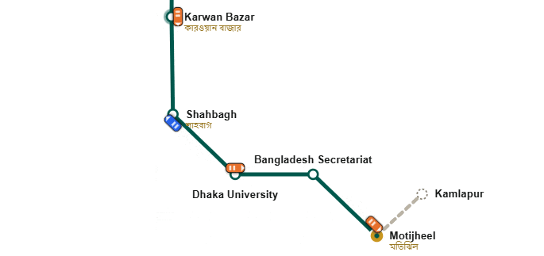
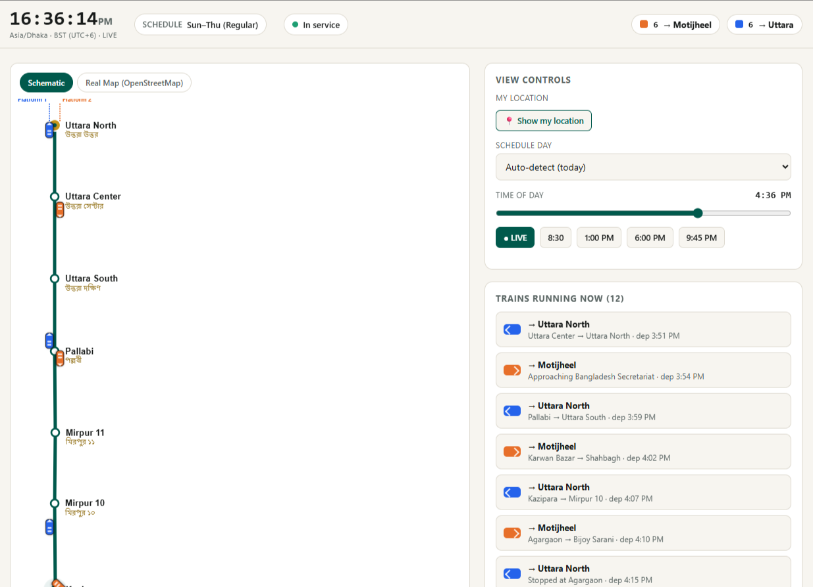
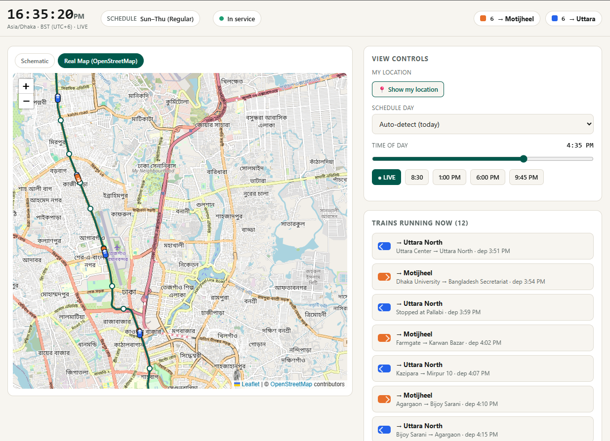

# Dhaka MRT Line 6 — Live Map (React)

A responsive React + Vite app that simulates **real-time train positions** on
Dhaka's MRT Line 6, based on **Bangladesh Standard Time (UTC+6)** and the
official timetable — plus a real-world map view built from live OpenStreetMap
data, and a linked fare & route chart.

**Live demo:** https://dhaka-metro-live-map.vercel.app/

## Preview

<div align="center">



  

</div>

## Features
- **Schematic map** — dynamically drawn SVG, no image assets — with direction-aware
  train icons (southbound on Platform 2/right, northbound on Platform 1/left) and
  platform pulses.
- **Real map** — a second tab rendering the actual MRT-6 alignment on OpenStreetMap
  tiles (Leaflet), sourced from the real surveyed track geometry and station
  locations via the Overpass API. Trains are rotated train-shaped glyphs that
  follow the real curves and face their direction of travel.
- Trains depart per the official headway bands for the detected day type, glide
  between stations with ease-in/ease-out acceleration, and hold **30–60s** at
  each platform (longer during the ~8–10am / ~5–7pm rush). Concurrent trains are
  capped at **14** (DMTCL's actual active fleet size, out of 24 six-coach sets).
- **Live location** — opt-in GPS shows your position snapped onto the route on
  both map views (real lat/lon on the real map; projected onto the nearest point
  of the real route polyline on the schematic map).
- Auto-detects the schedule day (Sun–Thu / Friday / Saturday / Govt. Holiday) in
  Dhaka time. Time scrubber + presets to preview any moment; **Go Live** snaps
  back to real time.
- On mobile, the schematic map opens in a zoomed-in 4:3 viewport you drag
  vertically to pan through the line, auto-centered on your live location.
- Side panel: running trains, next departures with countdowns, fleet breakdown,
  service status, legend.
- Linked **Fare & Route Chart** (`/mrt6_fare_chart.html`) — station-to-station
  fares (single journey / MRT Pass / Freedom Fighter & senior discounts),
  journey time/distance finder, and the full fare matrix. Linked from and back
  to the live map.

## Run locally
```bash
npm install
npm run dev      # http://localhost:5173
```

## Build
```bash
npm run build    # outputs to dist/
npm run preview  # serve the production build locally
```

## Deploy to Vercel
This is a standard Vite project — Vercel detects it automatically.

**Option A — Dashboard:** import the repo, set **Root Directory** to `mrt6-react`
(if the repo root is the parent folder). Framework preset: **Vite**.
Build command `npm run build`, output directory `dist`. Deploy.

**Option B — CLI:**
```bash
npm i -g vercel
cd mrt6-react
vercel        # follow prompts (Framework: Vite, Output: dist)
vercel --prod
```

No `vercel.json` is required. Everything in `public/` (fare chart, data JSON, map
image) is served at the site root.

## Project structure
```
src/
  data.js              stations, geometry, timetable, holidays
  simulation.js        BST clock, departure generation, position interpolation, fleet cap
  geo.js               GPS fix -> schematic map projection (real route polyline)
  realRoute.js          real-world MRT-6 track + station coordinates (OpenStreetMap)
  realGeo.js           simulated train position -> real lat/lon + heading
  hooks/               useGeolocation, useMediaQuery
  App.jsx              state + layout (250ms tick loop), schematic/real map toggle
  components/          MetroMap, RealMap, StatusBar, Controls, TrainList,
                       NextDepartures, FleetInfo, Legend
public/                mrt6_fare_chart.html, mrt6_data.json, 1-6.png.webp
preview/               README screenshots
```

## Data sources
- Timetable, fares, and station list: official MRT-6 published schedule/fare chart.
- Real-world track geometry and station coordinates: [OpenStreetMap](https://www.openstreetmap.org/copyright)
  contributors (relation "এমআরটি লাইন ৬" / Dhaka Metro Rail Line 6), via the Overpass API.

## Notes
- Train positions are a **schedule-based simulation**, not live GPS — only your
  own "show my location" marker uses real GPS.
- Govt-holiday auto-detect covers fixed-date national holidays only; add Eid/lunar
  dates to the `HOLIDAYS` set in `src/data.js`.
- The Friday "first train from Motijheel 3:20 AM" in the source is a typo for 3:20 PM
  (Friday is afternoon-only); the code uses 15:20.
